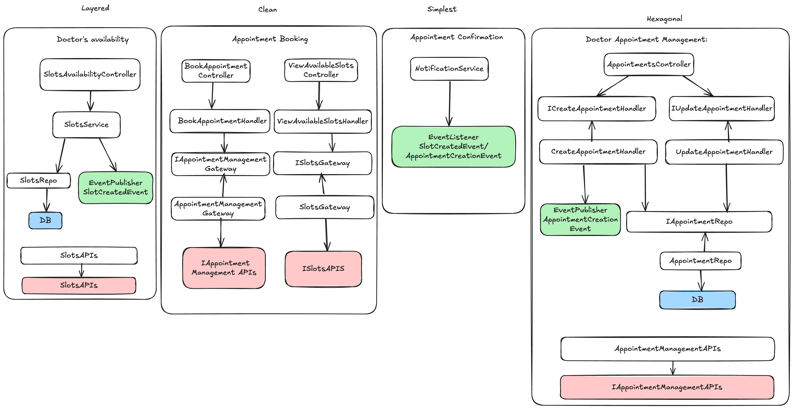

# Doctor Booking Modular Monolith

## Description

This project is a backend system for a doctor appointment booking application. It follows a modular monolith architectural pattern with three different architectures layered, hexagonal and clean.
For more detailed information of the architectural patterns used in this project, please refer to documentation [here](lhttps://docs.google.com/document/d/1G3y16cTEYC__xfKTnoHP3YrW0FQSRB2kf8S23i1Gg8M/edit?tab=t.0#heading=h.5uoc4mfz7mn4).

## Technology stack

- Java 17
- Spring Boot 3.4
- Maven
- PostgreSQL 17

## Diagrams / Illustrations

### Project High Level Components Architecture


### C4 Model


## Swagger URL
http://localhost:8080/swagger-ui.html

## Installation

To install and run the project:

1. Clone the repository:
    ```sh
    git clone https://github.com/ToqaMagdy/doctor-booking-modular-monolith.git
    cd doctor-booking
    ```
2. Configure the Application
    ```
    spring.datasource.url=jdbc:postgresql://localhost:5432/{database}
    spring.datasource.username={username}
    spring.datasource.password={password}
    ```
   
3. Build the project using Maven:
    ```sh
    mvn clean install
    ```

4. Run the application:
    ```sh
    mvn spring-boot:run
    ```

## Running Tests

```sh
mvn test